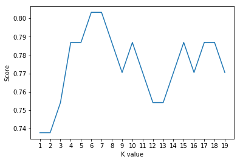

# Heart Disease Predictor

## Inspiration
Scroll down and you'll see in the charts that almost 50% people who went to dotors for heart diseases checkup, had a heart disease. This was the biggest point of inspiration for us. We wanted to, and have built a website that can predict the chances of a person having heart disease just by asking a few quick questions from them.

## What it does
This aplication asks various questions from the user and based on the responses, it predicts the chances of that person being exposed to one or more heart related diseases.

## How we built it
We build it using HTML, CSS and Javascript in the fontend.
We used Python and its various libraries in the backend.
We used KNN Algorithm, a machine learning algorithm, and predicted the chances of having a heart disease.

## Challenges we ran into
1. Connecting Python backend to Web frontend.
2. Making 2 different front ends for two types of users: doctors and non-doctors.
3. Increasing the accuracy of prediction using KNN.

## Accomplishments that we're proud of
1. We are proud that we are able to achieve 88.52% accuracy when doctors use this application.
2. 80.33% accuracy when non-doctors use this application as the data we collect here is limited.

## What we learned
We learned many things, how to connect python with web applications, why KNN is used and how to develop a KNN algorithm.

## What's next for HeartDiseasePredictor
We would like to work more on increasing the accuracy of prediction. That can be achieved by making this machine learning algortihm more dynamic that can learn with increased usage.

## Doctor's Version
```python
# Data Preprocessing Doctor's version

# Importing the libraries
import numpy as np
import matplotlib.pyplot as plt
import pandas as pd
import seaborn as sns
import matplotlib.pyplot as plt
from sklearn.utils import shuffle

# Import the dataset
dataset = pd.read_csv('heart.csv')
#dataset = shuffle(dataset)
#X = dataset.iloc[:, [0,1,2,3,4,5,7,8]].values #matrix of independent variables
X = dataset.iloc[:, :-1].values #matrix of independent variables
Y = dataset.iloc[:, 13].values #matrix of dependent variables

# Taking care of missing data
from sklearn.preprocessing import Imputer
imputer = Imputer(missing_values = 'NaN', strategy = 'most_frequent', axis = 0)
imputer.fit(X)
X = imputer.transform(X)

# Splitting the dataset into training and test set
from sklearn.cross_validation import train_test_split
X_train, X_test, Y_train, Y_test = train_test_split(X, Y, test_size = 0.2, random_state = 0)

# Feature Scaling
from sklearn.preprocessing import StandardScaler
sc_X = StandardScaler()
X_train = sc_X.fit_transform(X_train)
X_test = sc_X.transform(X_test)

# K-Nearest Neighbos (K-NN)
from sklearn.neighbors import KNeighborsClassifier
knn_classifier = KNeighborsClassifier(n_neighbors = 10, metric = 'minkowski', p = 2)
knn_classifier.fit(X_train, Y_train)
print("{} NN Score, i.e., accuracy is: {:.2f}%".format(10, knn_classifier.score(X_test, Y_test)*100))
```

    10 NN Score, i.e., accuracy is: 88.52%


```python
sns.countplot(x='sex', data=dataset, palette="mako_r")
plt.xlabel("Sex (0 = female, 1= male)")
plt.show()
```


```python
pd.crosstab(dataset.age,dataset.target).plot(kind="bar",figsize=(20,6))
plt.title('Heart Disease Frequency for Ages')
plt.xlabel('Age')
plt.ylabel('Frequency')
plt.savefig('heartDiseaseAndAges.png')
plt.show()
```


```python
# Try to find best k value
scoreList = []
for i in range(1,20):
    knn_classifier2 = KNeighborsClassifier(n_neighbors = i)  # n_neighbors means k
    knn_classifier2.fit(X_train, Y_train)
    scoreList.append(knn_classifier2.score(X_test, Y_test))
    
plt.plot(range(1,20), scoreList)
plt.xticks(np.arange(1,20,1))
plt.xlabel("K value")
plt.ylabel("Score")
plt.show()
```


## Normal Version
```python
# Data Preprocessing - Non Doctor's version

# Importing the libraries
import numpy as np
import matplotlib.pyplot as plt
import pandas as pd
import seaborn as sns
import matplotlib.pyplot as plt
from sklearn.utils import shuffle

# Import the dataset
dataset = pd.read_csv('heart.csv')
#dataset = shuffle(dataset)
X = dataset.iloc[:, [0,1,2,3,4,5,7,8]].values #matrix of independent variables
#X = dataset.iloc[:, :-1].values #matrix of independent variables
Y = dataset.iloc[:, 13].values #matrix of dependent variables

# Taking care of missing data
from sklearn.preprocessing import Imputer
imputer = Imputer(missing_values = 'NaN', strategy = 'most_frequent', axis = 0)
imputer.fit(X)
X = imputer.transform(X)

# Splitting the dataset into training and test set
from sklearn.cross_validation import train_test_split
X_train, X_test, Y_train, Y_test = train_test_split(X, Y, test_size = 0.2, random_state = 0)

# Feature Scaling
from sklearn.preprocessing import StandardScaler
sc_X = StandardScaler()
X_train = sc_X.fit_transform(X_train)
X_test = sc_X.transform(X_test)

# K-Nearest Neighbos (K-NN)
from sklearn.neighbors import KNeighborsClassifier
knn_classifier = KNeighborsClassifier(n_neighbors = 7, metric = 'minkowski', p = 2)
knn_classifier.fit(X_train, Y_train)
print("{} NN Score, i.e., accuracy is: {:.2f}%".format(7, knn_classifier.score(X_test, Y_test)*100))
```

    7 NN Score, i.e., accuracy is: 80.33%


```python
# Try to find best k value
scoreList = []
for i in range(1,20):
    knn_classifier2 = KNeighborsClassifier(n_neighbors = i)  # n_neighbors means k
    knn_classifier2.fit(X_train, Y_train)
    scoreList.append(knn_classifier2.score(X_test, Y_test))
    
plt.plot(range(1,20), scoreList)
plt.xticks(np.arange(1,20,1))
plt.xlabel("K value")
plt.ylabel("Score")
plt.show()
```




